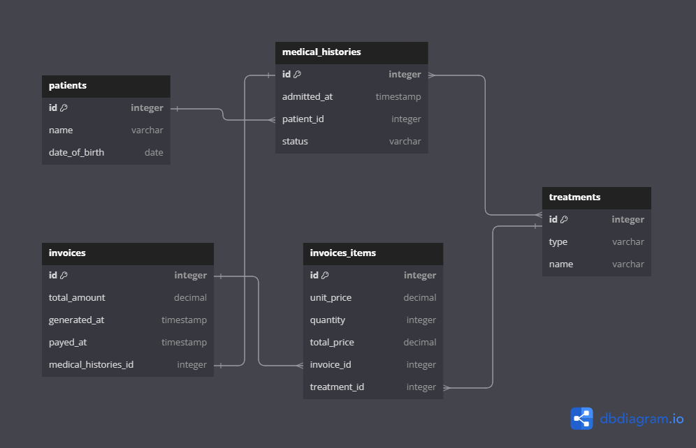

<a name="readme-top"></a>

<!-- TABLE OF CONTENTS -->

# 📗 Table of Contents

- [📗 Table of Contents](#-table-of-contents)
- [📖 DB\_clinic ](#-db_clinic-)
  - [🛠 Built With ](#-built-with-)
    - [Tech Stack ](#tech-stack-)
    - [Key Features ](#key-features-)
  - [💻 Getting Started ](#-getting-started-)
  - [Setup](#setup)
  - [👥 Authors ](#-authors-)
  - [🔭 Future Features ](#-future-features-)
  - [🤝 Contributing ](#-contributing-)
  - [⭐️ Show your support ](#️-show-your-support-)
  - [🙏 Acknowledgments ](#-acknowledgments-)
  - [❓ FAQ ](#-faq-)
  - [📝 License ](#-license-)

<!-- PROJECT DESCRIPTION -->

# 📖 DB_clinic <a name="about-project"></a>


This project includes the implementation of a clinic's database from a relational diagram where the tables and their columns are specified, as well as the relationships between them. Accordingly, the tables are built and their relationships are established.




## 🛠 Built With <a name="built-with"></a>

The project is built using SQL for database management. Getting Started Follow these steps to understand and work on the project:


### Tech Stack <a name="tech-stack"></a>

The project is built using the following technologies:

<details>
  <summary>Server</summary>
  <ul>
    <li><a href="https://expressjs.com/">Express.js</a></li>
  </ul>
</details>

<details>
<summary>Database</summary>
  <ul>
    <li><a href="https://www.postgresql.org/">PostgreSQL</a></li>
  </ul>
</details>

<!-- Features -->

### Key Features <a name="key-features"></a>


- **SQL Database Management**
- **Relational Diagram**

<p align="right">(<a href="#readme-top">back to top</a>)</p>

<!-- GETTING STARTED -->

## 💻 Getting Started <a name="getting-started"></a>

## Setup

To get a local copy up and running, follow these steps.

1. Clone this repository to your local machine:

```
git clone https://github.com/maximoortelli/diagram_clinic.git

```

2. Set up a PostgreSQL database named clinic.


Make sure you have PostgreSQL installed and configured on your machine before running the command.


## 👥 Authors <a name="authors"></a>

👤 **Maximo Ortelli**

-   GitHub: [@githubhandle](https://github.com/maximoortelli)
-   LinkedIn: [LinkedIn](https://www.linkedin.com/in/maximo-ortelli-rueda/)

<p align="right">(<a href="#readme-top">back to top</a>)</p>

<!-- FUTURE FEATURES -->

## 🔭 Future Features <a name="future-features"></a>

- [ ] **User Authentication**

<p align="right">(<a href="#readme-top">back to top</a>)</p>

<!-- CONTRIBUTING -->

## 🤝 Contributing <a name="contributing"></a>

Contributions, issues, and feature requests are welcome!

Feel free to check the [issues page](https://github.com/maximoortelli/diagram_clinic/issues).

<p align="right">(<a href="#readme-top">back to top</a>)</p>

<!-- SUPPORT -->

## ⭐️ Show your support <a name="support"></a>


If you like this project or if it helped you, please give a ⭐️. I'd really appreciate it!

<p align="right">(<a href="#readme-top">back to top</a>)</p>

<!-- ACKNOWLEDGEMENTS -->

## 🙏 Acknowledgments <a name="acknowledgements"></a>

I would like to thank Microverse and all my peers and colleagues at Microverse for giving me the opportunity to work on this project.

<p align="right">(<a href="#readme-top">back to top</a>)</p>

<!-- FAQ (optional) -->

## ❓ FAQ <a name="faq"></a>

**How do I set up the PostgreSQL database for this project?**

Clone the repository to your local machine
Create a new PostgreSQL database named "clinic".
Execute the SQL commands in the "schema.sql" file to create the necessary table structure.

<p align="right">(<a href="#readme-top">back to top</a>)</p>

<!-- LICENSE -->

## 📝 License <a name="license"></a>

This project is [MIT](./LICENSE).

<p align="right">(<a href="#readme-top">back to top</a>)</p>
